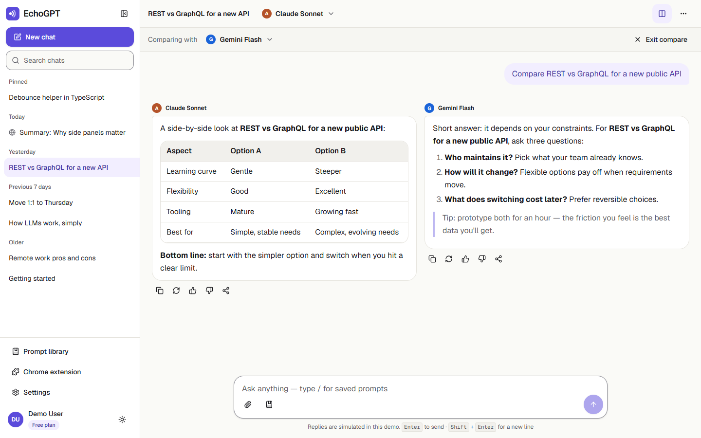

# EchoGPT Redesign

A redesign concept for [EchoGPT](https://echogpt.live), AppifyDevs' multi-model AI chat product, built as one **Next.js 15 + TypeScript** project with three surfaces that share one design system, one theme and one mock data layer:

| Route        | What it is                                                                                            |
| ------------ | ----------------------------------------------------------------------------------------------------- |
| `/`          | **Landing page** — statically generated marketing page that drives “Add to Chrome” / “Start chatting” |
| `/chat`      | **Web app redesign** — three-zone chat with streaming replies, compare mode and a prompt library      |
| `/extension` | **Chrome extension concept** — interactive prototype of the popup and side panel on a demo page       |

> **Live demo:** _add the Vercel URL here after deploying_ · **Repository:** https://github.com/zobayer-hosen/echogpt-redesign



---

## 1. Project overview

EchoGPT lets people chat with several AI models (GPT, Claude, Gemini, Llama, Mistral, DeepSeek) from a web app or a Chrome side panel. This project delivers the three parts of the brief:

- **Part A — Web app (`/chat`)**: responsive shell (sidebar → icon rail → drawer), grouped/searchable history with pin/rename/delete, model selector with Pro locks, empty state with suggestions, Markdown replies with highlighted code, mocked word-by-word streaming with stop / regenerate / retry, compare mode, prompt library, command palette, settings, and localStorage persistence.
- **Part B — Landing (`/`)**: navbar, hero, features, AI models, product preview, why EchoGPT, pricing, FAQ (with FAQPage JSON-LD), testimonials, final CTA and footer.
- **Part C — Extension concept (`/extension`)**: a fake browser window with a demo article and the 380 × 600 popup (or a full-height side panel) — chat with page-context chip, quick actions, history, settings, model picker with “compare 2”, and a 3-step onboarding.

Conversations started in the extension appear in the web app history (and vice versa) because both use the same store.

### Things to try

- **Chat:** click a suggestion card, press <kbd>Enter</kbd> to send, <kbd>Shift</kbd>+<kbd>Enter</kbd> for a new line, type <kbd>/</kbd> for saved prompts, press <kbd>Ctrl/⌘</kbd>+<kbd>K</kbd> for the command palette, and toggle **Compare** in the header.
- **Error state:** send a message containing `simulate error` to see the error + retry state.
- **Extension:** select a sentence in the article, then run **Explain selection**; press <kbd>Ctrl/⌘</kbd>+<kbd>Shift</kbd>+<kbd>E</kbd> to open/close the popup; open `/extension?mode=sidepanel` for side-panel mode.

## 2. Setup

Requirements: **Node.js 20.9+** and npm.

```bash
npm install
npm run dev        # http://localhost:3000
npm run build      # production build
npm run start      # serve the production build
npm run lint       # ESLint (next/core-web-vitals + TypeScript + import sorting)
npm run typecheck  # tsc --noEmit (strict)
npm run format     # Prettier + Tailwind class sorting
```

Optional: copy `.env.example` to `.env.local` and set `NEXT_PUBLIC_SITE_URL` (used for canonical URLs, Open Graph and the sitemap). On Vercel it falls back to `VERCEL_PROJECT_PRODUCTION_URL` automatically.

**Deploying to Vercel:** import the repository (framework preset: Next.js, no settings needed). To get real-user numbers, enable **Web Analytics** and **Speed Insights** in the project dashboard — the scripts are only rendered on Vercel builds so local and non-Vercel builds don’t log 404s.

## 3. Technologies

| Layer         | Choice                                                   | Why                                                     |
| ------------- | -------------------------------------------------------- | ------------------------------------------------------- |
| Framework     | Next.js 15 (App Router), React 19                        | SSG for the landing page, client islands for the app    |
| Language      | TypeScript 5.9, `strict`, no `any`                       | Safer refactors; TS 5.x is the line Next 15 supports    |
| Styling       | Tailwind CSS v4 + CSS-variable design tokens             | One token set drives both themes                        |
| UI primitives | Radix UI (shadcn/ui-style components in `components/ui`) | Accessible dialogs, menus, tabs, accordion, tooltips    |
| Icons         | lucide-react                                             | Tree-shaken named imports                               |
| Animation     | Motion (Framer Motion) with `LazyMotion` + `m.*`         | Small bundle; `MotionConfig reducedMotion="user"`       |
| State         | Zustand + `persist`                                      | Tiny, localStorage persistence                          |
| Theme         | next-themes                                              | Light / dark / system without a flash                   |
| Markdown      | react-markdown + remark-gfm + rehype-highlight           | Tables, lists and highlighted code blocks (lazy-loaded) |
| Forms         | react-hook-form + zod                                    | Rename, prompt library, custom actions, API endpoint    |
| Command menu  | cmdk                                                     | Accessible combobox for Ctrl/⌘+K (loaded on first open) |
| Toasts        | sonner                                                   | Accessible, themeable notifications with undo actions   |
| Quality       | ESLint, Prettier (+ tailwind plugin), strict TS          | Consistent, reviewable code                             |
| Analytics     | @vercel/analytics, @vercel/speed-insights                | Real Core Web Vitals once deployed                      |

## 4. Assumptions

- **No real backend or AI API.** Replies come from `lib/services/chat.service.ts`, which streams canned Markdown word by word behind an `AbortSignal` — the same shape a real streaming API has, so only that file changes when wiring up EchoGPT. The UI says “Replies are simulated in this demo”.
- **Authentication is out of scope.** A demo user (Free plan) is signed in; Pro models show a lock. Signing out in the extension is simulated.
- **Sample content is labelled.** Model names are family names without versions, and prices, testimonials and FAQ answers are sample content, marked as such on the page.
- **The extension is a web prototype** of the concept, not a packaged Manifest V3 build.
- **Data stays in the browser** (localStorage). Clearing site data resets the seeded demo history.
- **Branding:** the EchoGPT name is used because the product belongs to the company setting the assignment; the logo mark here is a simple placeholder drawn for this project.
- **Display font:** the PRD’s first choice, Soria, is distributed under different licences on different download sites and I couldn’t verify one, so I used the PRD’s **Plan B — Instrument Serif (SIL OFL)** via `next/font/google`. Swapping to Soria is a one-line change in `src/app/fonts.ts`.
- **Next.js 15 is pinned** as the PRD specifies (npm `latest` is 16.x). Next 15 pins an older PostCSS with published advisories, so `package.json` overrides it to a patched version; `npm audit` reports 0 vulnerabilities.

## 5. Additional features

- Dark / light / system theme with no flash, tested at every breakpoint
- Framer Motion: scroll reveals, message enter, drawer / dialog / tab transitions, `layoutId` pills (model list, extension tab bar, pricing toggle, segmented controls)
- Compare mode (two models side by side, stacked on mobile) in both the web app and the extension
- Prompt library with categories, search and a validated “New prompt” form; `/` inserts prompts in any composer
- Command palette (<kbd>Ctrl/⌘</kbd>+<kbd>K</kbd>): new chat, switch model, search chats, toggle theme, settings
- Delete with **Undo**, pin, rename, copy link to a conversation or a single reply (deep links scroll to the message)
- Attachment chips (UI only), character counter, IME-safe Enter handling, stop / regenerate / retry, like / dislike
- Extension: page / selection context chip, six quick actions + user-created custom actions, onboarding tour, side-panel mode, signed-out state, API endpoint moved under **Advanced**
- Accessibility work (below), custom 404, error boundary, loading skeletons, empty states, Open Graph image, sitemap, robots, web manifest, JSON-LD

## 6. Extras

### Accessibility

- Landmarks (`header`, `nav`, `main`, `footer`), one `h1` per page and a skip link on every page
- Full keyboard use with a visible `:focus-visible` ring; dialogs trap focus and **return it to whatever opened them** (including hotkeys and menus — handled by `useReturnFocus`)
- Every icon-only button has an accessible name (`IconButton` requires a `label`)
- Streaming replies use `aria-live="polite"` with `aria-busy` while tokens arrive; typing indicators and counts use `role="status"`; form errors use `role="alert"`
- Colour tokens meet WCAG 2.2 AA in both themes; form borders use a stronger `--input` token for 3:1 non-text contrast
- `prefers-reduced-motion` removes movement (Motion keeps only opacity; CSS animations are neutralised)
- Touch targets grow to 44 px on coarse pointers (`pointer-coarse:` variants)

### Performance

- Landing page is fully static (`force-static`) and mostly Server Components; motion wrappers are small client islands
- The hero headline animates with CSS keyframes (not JS), so the LCP text paints before hydration
- Markdown + syntax highlighting and the command palette are split into lazy chunks
- `next/font` (no layout shift), `next/image` with AVIF/WebP and `sizes`; inactive preview tabs don’t load their images
- Streaming text lives in a separate in-memory store, so localStorage is written once per reply, not once per token
- Long threads render the latest 100 messages with “Show earlier messages”

### Folder structure

```
src/
├─ app/                 # routes: (marketing)/, chat/, chat/[id]/, extension/, 404, error, sitemap, robots, OG image
├─ components/
│  ├─ ui/               # Radix-based primitives: button, dialog, sheet, dropdown, popover, tabs, accordion…
│  ├─ shared/           # used by /chat and /extension: ModelSelector, ModelList, PromptInput, MessageBubble, Markdown…
│  ├─ landing/          # Navbar, Hero, Features, Models, Preview, WhyUs, Pricing, Faq, Testimonials, Cta, Footer
│  ├─ chat/             # AppShell, Sidebar, ChatHeader, MessageList, Composer, EmptyState, dialogs, CommandPalette
│  └─ extension/        # BrowserFrame, DemoArticle, Popup, TabBar, ChatTab, QuickActions, History, Settings…
├─ hooks/               # useAutoResize, useHotkeys, useMediaQuery, useStreamingText, useStickToBottom, useReturnFocus…
├─ lib/
│  ├─ data/             # all content & mock data (models, features, FAQ, pricing, prompts, quick actions, seeds…)
│  ├─ services/         # chat.service (mock streaming), ids, abortable delays
│  ├─ motion.ts         # shared Motion variants
│  └─ utils.ts          # cn(), groupByDate, buildTurns, formatters
├─ store/               # chat, settings, prompts (persisted); stream, ui, extension (in-memory); actions
└─ types/               # shared TypeScript types
```

### UX audit — before → after

| Surface   | Finding (current product)                                             | Redesign                                                    |
| --------- | --------------------------------------------------------------------- | ----------------------------------------------------------- |
| Web       | Initial HTML holds only the logo and name; content is client-rendered | Statically generated landing page with real content         |
| Web       | Generic meta description; `og:image` is the favicon SVG               | Per-route metadata, 1200 × 630 OG image, JSON-LD, sitemap   |
| Web       | No public explanation of models, pricing or FAQ before sign-in        | Full landing page at `/`                                    |
| Extension | “Configure your API endpoint” shown as a user setting                 | Moved under Settings › Advanced (collapsed, validated)      |
| Extension | Quick actions limited to summarize and explain                        | Six actions + custom actions                                |
| Extension | Compare is mentioned but has no dedicated view                        | “Compare 2 models” switch; side-by-side view in the web app |
| Extension | Low awareness (123 users, 7 ratings on the store listing)             | Landing CTAs point to the Chrome Web Store listing          |

The PRD also lists web-app findings marked “verify” (chat layout, mobile sidebar, keyboard focus/contrast) that need screenshots of the live signed-in app; those before/after captures are still to be added.

### Known limitations / next steps

- Replies are canned; generic prompts get a clearly labelled structured answer rather than a real one.
- No automated test suite yet — flows were checked with a headless-browser script during development (send → URL swap, streaming, stop, error + retry, `/` menu, Ctrl+K, compare, persistence, mobile drawer, focus return, no horizontal overflow).
- Chat routes are heavier than the landing page (Radix, Motion, forms); lazy-loading the dialogs would trim the first load further.
- Lighthouse scores should be measured on the deployed Vercel URL and added here.

### Credits

- Display font: **Instrument Serif** (SIL Open Font License) · UI font: **Geist** / **Geist Mono** by Vercel (OFL)
- Icons: **Lucide** (ISC) · UI primitives: **Radix UI** (MIT)
