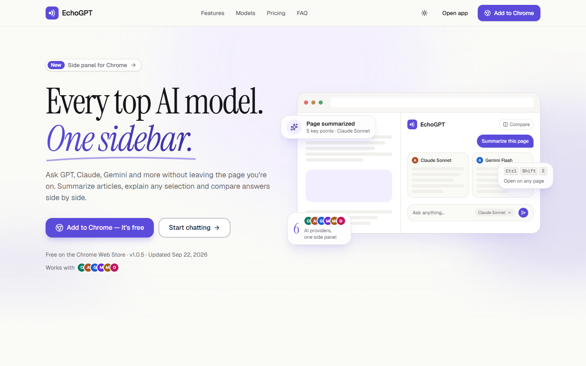
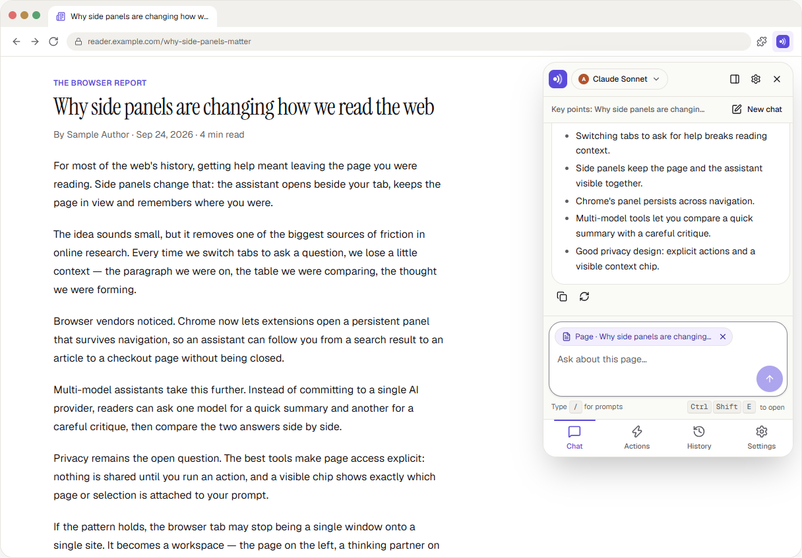
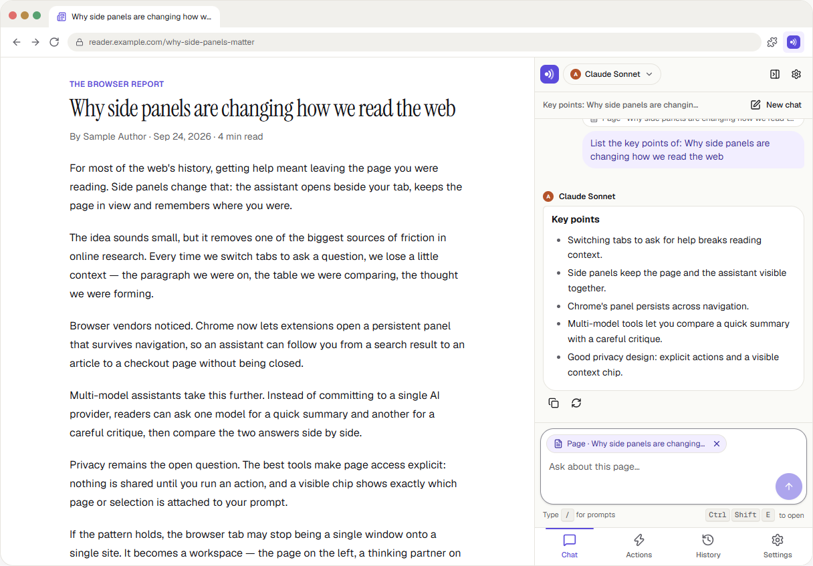

<div align="center">

# EchoGPT Redesign

**Every top AI model. One sidebar.**

A redesign of [EchoGPT](https://echogpt.live) — AppifyDevs' multi-model AI chat product — delivered as one Next.js project with a landing page, a redesigned chat web app and an interactive Chrome-extension concept that share a single design system.


**Live demo:** _Vercel URL to be added_ · [Repository](https://github.com/zobayer-hosen/echogpt-redesign) · [Product requirements (PRD)](docs/PRD.md)

<picture>
  <source media="(prefers-color-scheme: dark)" srcset="public/screenshots/landing-dark.png">
  
</picture>

</div>

---

## Contents

1. [Overview](#1-overview)
2. [Screenshots](#2-screenshots)
3. [Features](#3-features)
4. [Getting started](#4-getting-started)
5. [Tech stack](#5-tech-stack)
6. [Architecture](#6-architecture)
7. [Accessibility](#7-accessibility)
8. [Performance](#8-performance)
9. [Assumptions](#9-assumptions)
10. [UX audit: before → after](#10-ux-audit-before--after)
11. [Known limitations & next steps](#11-known-limitations--next-steps)
12. [Credits](#12-credits)

---

## 1. Overview

EchoGPT lets people chat with several AI models — GPT, Claude, Gemini, Llama, Mistral and DeepSeek — from a web app or a Chrome side panel. This project covers all three parts of the brief as routes of one app, so they share one design system, one theme and one mock data layer:

| Route        | Part | What it is                                                                                              |
| ------------ | ---- | ------------------------------------------------------------------------------------------------------- |
| `/`          | B    | **Landing page** — statically generated marketing page that drives “Add to Chrome” and “Start chatting” |
| `/chat`      | A    | **Web app redesign** — three-zone chat with streaming replies, compare mode and a prompt library        |
| `/extension` | C    | **Chrome extension concept** — interactive popup and side panel on a demo article                       |

Conversations started in the extension show up in the web app history (and the other way round) because both surfaces use the same store.

## 2. Screenshots

Every surface supports light and dark mode; the images below follow your GitHub theme.

| Web app (`/chat`)                                                                                                                                                                                                                             | Extension popup (`/extension`)                                                                                                                                                                                                                            |
| --------------------------------------------------------------------------------------------------------------------------------------------------------------------------------------------------------------------------------------------- | --------------------------------------------------------------------------------------------------------------------------------------------------------------------------------------------------------------------------------------------------------- |
| <picture><source media="(prefers-color-scheme: dark)" srcset="public/screenshots/web-app-dark.png"></picture>        | <picture><source media="(prefers-color-scheme: dark)" srcset="public/screenshots/extension-popup-dark.png"></picture> |
| **Side panel** (`/extension?mode=sidepanel`)                                                                                                                                                                                                  | **Landing page** (`/`)                                                                                                                                                                                                                                    |
| <picture><source media="(prefers-color-scheme: dark)" srcset="public/screenshots/side-panel-dark.png"></picture> | <picture><source media="(prefers-color-scheme: dark)" srcset="public/screenshots/landing-dark.png"></picture>                                      |

## 3. Features

### Part A — Web app (`/chat`)

- **Responsive shell:** fixed sidebar on desktop, icon rail on tablet, slide-over drawer on mobile; the composer stays pinned using `100dvh`.
- **Conversation history:** new chat, search, groups (Pinned · Today · Yesterday · Previous 7 days · Older), pin, rename and delete with **Undo**.
- **Model selector** with provider, speed and quality tags and Pro locks; the choice is saved per conversation.
- **Messages:** Markdown with tables and syntax-highlighted code blocks (copy button), model badge on each reply, timestamps.
- **Streaming:** mocked word-by-word replies with typing indicator, **stop**, **regenerate** and an error state with **retry**.
- **Compare mode:** one prompt, two models, answers side by side (stacked on mobile).
- **Prompt library** with categories, search and a validated “New prompt” form; type <kbd>/</kbd> in any composer to insert one.
- **Command palette** (<kbd>Ctrl/⌘</kbd>+<kbd>K</kbd>): new chat, switch model, search chats, toggle theme, open settings.
- **Settings:** theme, default model, font size, clear history. Everything persists in `localStorage`.

### Part B — Landing page (`/`)

- **Hero:** the headline words rise in with CSS (so they paint before JavaScript loads). Around them, Framer Motion staggers in the copy and buttons, draws an underline under the accent, and builds the product mock piece by piece: the prompt bubble, then two answer cards with their lines streaming in. The mock tilts in 3D toward the pointer, floats, and is surrounded by floating highlight cards over drifting background glows.
- **Features**, **Why EchoGPT** (comparison table), **Pricing** (monthly / yearly toggle), **FAQ** (Radix accordion + FAQPage JSON-LD), **Testimonials** (clearly labelled samples), **final CTA** and **footer**.
- **AI models — task picker:** choose a task (“Summarizing pages”, “Maths & code”…) to see the recommended model in a spotlight card. The card shows the provider, Free or Pro, the model name, an example prompt, animated speed and quality meters, and the context window. Its content swaps with a staggered cross-fade and a glow in the provider's colour. It's built on Radix Tabs, so arrow keys work, and it becomes a swipeable row on mobile.
- **Product preview:** tabbed screenshots of this build that swap with the theme.
- **SEO:** per-route metadata, Open Graph image, sitemap, robots, web manifest and `SoftwareApplication` JSON-LD.

### Part C — Chrome extension concept (`/extension`)

- A fake browser window with a demo article and the **380 × 600 popup**, or a full-height **side panel**.
- **Bottom tab bar** (Chat · Actions · History · Settings) with arrow-key navigation and `aria-current`.
- **Chat** with a page / selection **context chip**, <kbd>/</kbd> prompts and the <kbd>Ctrl/⌘</kbd>+<kbd>Shift</kbd>+<kbd>E</kbd> shortcut.
- **Quick actions:** Summarize page, Explain selection, Translate, Rewrite, Key points, Reply to email — plus user-created custom actions.
- **Model picker** with favourites and a “Compare 2 models” switch; **history** grouped by date with the source page; **settings** with the API endpoint moved under a collapsed **Advanced** section.
- **First-run onboarding** and a signed-out state.

### Things to try

- **Landing:** move your mouse over the hero mock, then click through the tasks in **AI models** (or use the arrow keys).
- **Chat:** click a suggestion card, press <kbd>Enter</kbd> to send (<kbd>Shift</kbd>+<kbd>Enter</kbd> for a new line), type <kbd>/</kbd> for saved prompts, press <kbd>Ctrl/⌘</kbd>+<kbd>K</kbd>, and toggle **Compare** in the header.
- **Error state:** send a message containing `simulate error` to see the error and retry flow.
- **Extension:** select a sentence in the article and run **Explain selection**; press <kbd>Ctrl/⌘</kbd>+<kbd>Shift</kbd>+<kbd>E</kbd> to open and close the popup; open `/extension?mode=sidepanel` for side-panel mode.

## 4. Getting started

**Requirements:** Node.js 20.9+ and npm.

```bash
git clone https://github.com/zobayer-hosen/echogpt-redesign.git
cd echogpt-redesign
npm install
npm run dev        # http://localhost:3000
```

| Script              | What it does                                              |
| ------------------- | --------------------------------------------------------- |
| `npm run dev`       | Development server with hot reload                        |
| `npm run build`     | Production build                                          |
| `npm run start`     | Serve the production build                                |
| `npm run lint`      | ESLint (next/core-web-vitals, TypeScript, import sorting) |
| `npm run typecheck` | `tsc --noEmit` in strict mode                             |
| `npm run format`    | Prettier with Tailwind class sorting                      |

**Environment (optional):** copy `.env.example` to `.env.local` and set `NEXT_PUBLIC_SITE_URL`, which is used for canonical URLs, Open Graph and the sitemap. On Vercel it falls back to `VERCEL_PROJECT_PRODUCTION_URL`, so no variables are needed there.

**Deploying to Vercel:** import the repository with the Next.js preset — no settings required. Enable **Web Analytics** and **Speed Insights** in the project dashboard for real-user Core Web Vitals; their scripts only render on Vercel builds, so local builds don't log 404s.

## 5. Tech stack

| Layer         | Choice                                                   | Why                                                                |
| ------------- | -------------------------------------------------------- | ------------------------------------------------------------------ |
| Framework     | Next.js 15 (App Router), React 19                        | Static generation for the landing page, client islands for the app |
| Language      | TypeScript 5.9, `strict`, no `any`                       | Safer refactors; TS 5.x is the line Next 15 supports               |
| Styling       | Tailwind CSS v4 + CSS-variable design tokens             | One token set drives both themes                                   |
| UI primitives | Radix UI (shadcn/ui-style components in `components/ui`) | Accessible dialogs, menus, tabs, accordion and tooltips            |
| Icons         | lucide-react                                             | Tree-shaken named imports                                          |
| Animation     | Motion (Framer Motion) with `LazyMotion` + `m.*`         | Small bundle; `MotionConfig reducedMotion="user"`                  |
| State         | Zustand + `persist`                                      | Tiny API, localStorage persistence                                 |
| Theme         | next-themes                                              | Light / dark / system without a flash                              |
| Markdown      | react-markdown + remark-gfm + rehype-highlight           | Tables, lists and highlighted code (lazy-loaded)                   |
| Forms         | react-hook-form + zod                                    | Rename, prompt library, custom actions, API endpoint               |
| Command menu  | cmdk                                                     | Accessible combobox for Ctrl/⌘+K (loaded on first open)            |
| Toasts        | sonner                                                   | Accessible notifications with undo actions                         |
| Quality       | ESLint, Prettier (+ Tailwind plugin), strict TypeScript  | Consistent, reviewable code                                        |
| Analytics     | @vercel/analytics, @vercel/speed-insights                | Real Core Web Vitals once deployed                                 |

## 6. Architecture

There is no backend. A typed mock service (`lib/services/chat.service.ts`) streams replies behind an `AbortSignal`, the same shape a real streaming API has, so connecting the real EchoGPT API only touches `lib/services`.

```
src/
├─ app/                 # routes: (marketing)/, chat/, chat/[id]/, extension/, 404, error, sitemap, robots, OG image
├─ components/
│  ├─ ui/               # Radix-based primitives: button, dialog, sheet, dropdown, popover, tabs, accordion…
│  ├─ shared/           # used by /chat and /extension: ModelSelector, PromptInput, MessageBubble, Markdown…
│  ├─ landing/          # Hero (+ motion islands), Features, Models task picker, Preview, Pricing, FAQ, Footer…
│  ├─ chat/             # AppShell, Sidebar, ChatHeader, MessageList, Composer, EmptyState, dialogs, CommandPalette
│  └─ extension/        # BrowserFrame, DemoArticle, Popup, TabBar, ChatTab, QuickActions, History, Settings…
├─ hooks/               # useAutoResize, useHotkeys, useMediaQuery, useStreamingText, useStickToBottom, useReturnFocus…
├─ lib/
│  ├─ data/             # all copy and mock data: models, features, FAQ, pricing, prompts, quick actions, seeds…
│  ├─ services/         # chat.service (mock streaming), ids, abortable delays
│  ├─ motion.ts         # every Motion variant lives here — components never define one-off animations
│  └─ utils.ts          # cn(), groupByDate, buildTurns, formatters
├─ store/               # chat, settings, prompts (persisted); stream, ui, extension (in-memory); actions
└─ types/               # shared TypeScript types
```

**Design system.** Colours are CSS variables in `app/globals.css` (a light set and a `.dark` set), exposed to Tailwind as token classes such as `bg-primary` and `text-muted-foreground`; components never use hex values. Type pairs a display serif for large headings (32 px and up) with Geist Sans for everything else and Geist Mono for code. Motion animates only `transform` and `opacity`, uses 150–300 ms for UI transitions, and respects reduced motion.

**Conventions.** Server Components by default, with `"use client"` only where state or motion is needed. Content lives in `lib/data`, never in JSX. Components stay small and single-purpose, props are typed, and commits follow Conventional Commits.

## 7. Accessibility

- Landmarks (`header`, `nav`, `main`, `footer`), one `h1` per page and a skip link on every page.
- Full keyboard use with a visible `:focus-visible` ring. Dialogs and drawers trap focus and **return it to whatever opened them**, including hotkeys and menus (`useReturnFocus`).
- Every icon-only button has an accessible name (`IconButton` requires a `label`). Decorative illustrations are exposed as a single labelled image.
- Streaming replies use `aria-live="polite"` with `aria-busy` while tokens arrive; typing indicators use `role="status"`; form errors use `role="alert"`.
- Colour tokens meet WCAG 2.2 AA in both themes; form borders use a stronger `--input` token for 3:1 non-text contrast.
- `prefers-reduced-motion` removes movement: Motion keeps only opacity, the hero tilt is disabled, and CSS animations are neutralised.
- Touch targets grow to 44 px on coarse pointers (`pointer-coarse:` variants).

## 8. Performance

- The landing page is fully static (`force-static`) and mostly Server Components; the motion pieces are small client islands that take server-rendered children.
- The hero headline — the largest element on the page — animates with CSS keyframes, so it paints before hydration and doesn't wait for JavaScript.
- Motion loads through `LazyMotion` with `domAnimation`, and the looping hero animations run on `transform` only.
- The Markdown renderer with syntax highlighting and the command palette are split into lazy chunks.
- `next/font` prevents layout shift; `next/image` serves AVIF/WebP with `sizes`, and inactive preview tabs don't load their images.
- Streaming text lives in a separate in-memory store, so `localStorage` is written once per reply rather than once per token.
- Long threads render the latest 100 messages, with a button to show earlier ones.

## 9. Assumptions

- **No real backend or AI API.** Replies are canned Markdown streamed word by word; the UI says “Replies are simulated in this demo”.
- **Authentication is out of scope.** A demo user on the Free plan is signed in; Pro models show a lock. Signing out in the extension is simulated.
- **Sample content is labelled.** Model names are family names without versions; prices, testimonials, FAQ answers and context sizes are sample content, marked as such on the page.
- **The extension is a web prototype** of the concept, not a packaged Manifest V3 build.
- **Data stays in the browser** (`localStorage`). Clearing site data resets the seeded demo history.
- **Branding:** the EchoGPT name is used because the product belongs to the company setting the assignment; the logo mark is a simple placeholder drawn for this project.
- **Display font:** the PRD's first choice, Soria, is distributed under different licences on different download sites and none could be verified, so the PRD's Plan B — **Instrument Serif** (SIL OFL) — is used. Switching to Soria is a one-line change in `src/app/fonts.ts`.
- **Next.js 15 is pinned** as the PRD specifies (npm `latest` is 16.x). Next 15 pins an older PostCSS with published advisories, so `package.json` overrides it to a patched version.

## 10. UX audit: before → after

| Surface   | Finding (current product)                                             | Redesign                                                    |
| --------- | --------------------------------------------------------------------- | ----------------------------------------------------------- |
| Web       | Initial HTML holds only the logo and name; content is client-rendered | Statically generated landing page with real content         |
| Web       | Generic meta description; `og:image` is the favicon SVG               | Per-route metadata, 1200 × 630 OG image, JSON-LD, sitemap   |
| Web       | No public explanation of models, pricing or FAQ before sign-in        | Full landing page at `/`, including a model task picker     |
| Extension | “Configure your API endpoint” shown as a user setting                 | Moved under Settings › Advanced (collapsed, validated)      |
| Extension | Quick actions limited to summarize and explain                        | Six actions + custom actions                                |
| Extension | Compare is mentioned but has no dedicated view                        | “Compare 2 models” switch; side-by-side view in the web app |
| Extension | Low awareness (123 users, 7 ratings on the store listing)             | Landing CTAs point to the Chrome Web Store listing          |

The [PRD](docs/PRD.md) also lists web-app findings marked “verify” (chat layout, mobile sidebar, keyboard focus and contrast) that need screenshots of the live signed-in app; those before/after captures are still to be added.

## 11. Known limitations & next steps

- Replies are canned; generic prompts get a clearly labelled structured answer rather than a real one.
- There's no automated test suite yet. Key flows were checked with headless-browser scripts during development: sending and streaming, stop, error and retry, the `/` menu, Ctrl+K, compare, persistence, the mobile drawer, focus return, the extension tabs and quick actions, the landing task picker, and no horizontal overflow at 360–1440 px.
- The active-state indicators that use `layoutId` (model list, extension tab bar, pricing toggle) switch instantly instead of sliding, because layout animations need Motion's larger `domMax` feature set. Loading it lazily would enable them.
- Chat routes are heavier than the landing page (Radix, Motion, forms); lazy-loading the dialogs would trim their first load.
- Lighthouse scores will be measured on the deployed Vercel URL and added here.

## 12. Credits

- Display font: **Instrument Serif** (SIL Open Font License) · UI fonts: **Geist** and **Geist Mono** by Vercel (OFL)
- Icons: **Lucide** (ISC) · UI primitives: **Radix UI** (MIT) · Animation: **Motion** (MIT)
- Built for the AppifyDevs Frontend Internship assignment.
